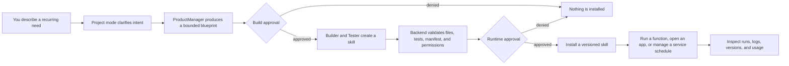
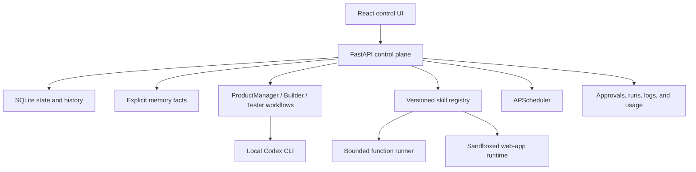

<div align="center">

# Eidolon

### A local-first personal agent that can remember deliberately, build its own skills, and evolve under your control.

[](#project-status)
[](#permission-boundaries)
[](backend/pyproject.toml)
[](frontend/package.json)
[](LICENSE)

Eidolon is an experiment in a different kind of personal AI: not a remote chatbot that forgets you, and not an autonomous process with unlimited authority, but a durable local system that can accumulate useful context and reusable capabilities without taking control away from its owner.

</div>

> [!IMPORTANT]
> Eidolon is under active development. It already has working chat, explicit memory CRUD, skill generation, validation, approvals, versioning, function execution, sandboxed web applications, scheduling, and run history. Automatic memory use, experience-driven adaptation, and fully autonomous long-term learning are **not implemented yet**.

## The idea

Most assistants start from zero on every task. Eidolon is being built to compound instead:

- remember durable facts that you can inspect, edit, and delete;
- turn repeated needs into tested, reusable skills;
- run those skills as bounded functions or isolated web applications;
- learn from outcomes over time without silently rewriting itself;
- keep every meaningful capability behind an explicit permission boundary.

The long-term goal is a personal agent whose usefulness grows with you while its authority remains legible, revocable, and yours.

## Project status

| Capability | Status | What that means today |
| --- | --- | --- |
| Local chat | ✅ Implemented | Chat mode answers through the locally available Codex CLI integration. |
| Explicit memory | ✅ Implemented | Memory facts have a local CRUD interface and SQLite persistence. |
| Memory-aware responses | 🧭 Planned | Stored facts are not yet automatically selected or injected into ordinary chat or skill runs. |
| Self-built skills | ✅ Implemented | Project mode can plan, generate, test, permission-review, and propose Python skill packages. |
| Skill use | ✅ Implemented | Installed skills can run as bounded functions or open as sandboxed ASGI web applications. |
| Skill composition | 🟡 Partial | Declared one-hop function calls are supported; nested invocation is not. |
| Scheduling | ✅ Implemented | Scheduler-only services have one required daily, weekly, or interval schedule. |
| Safe versioned evolution | ✅ Implemented | Updates are built as drafts and activated only after validation and approval. |
| Long-term adaptation | 🧭 Planned | Outcome capture, user feedback, adaptation proposals, and controlled promotion are not built yet. |
| Domain-level egress filtering | 🧭 Planned | Network domains are declared and approved, but Docker egress is not yet filtered per domain. |
| Fully parallel skill builds | 🧭 Planned | DAG batches are parallel-aware but currently execute serially in a shared workspace. |

The canonical unfinished-work ledger is [docs/todo.md](docs/todo.md). Completed milestones and their limitations are recorded in [docs/working_history.md](docs/working_history.md).

## How Eidolon grows a capability



Generation is not installation. Installation is not permission to run automatically. A generated service installs with its required schedule paused until the user resumes it. Those distinctions are core product behavior, not ceremony.

## Permission boundaries

Eidolon treats the backend as the control plane and generated code as untrusted.

- **Memory is user-owned.** Facts are explicit, editable, and deletable; the system does not silently save every conversation.
- **Skills stay contained.** Generated files are restricted to controlled proposed and installed skill roots.
- **Permissions are declarative.** Manifests describe runtime needs; the backend derives risk and decides what requires approval.
- **Generated code cannot approve itself.** Agents cannot install, enable, schedule, or bypass backend checks.
- **Execution is bounded.** Function skills use a JSON input/output protocol; web apps run behind an isolated origin and trusted gateway.
- **Versions are immutable.** The active installed version is never edited in place.
- **High-risk capabilities remain blocked.** Shell access, secrets, arbitrary filesystem access, browser automation, file deletion, and sensitive third-party actions are outside the current runtime contract.

Docker is the default skill sandbox. An explicit local/development fallback exists, but it is less isolated. See [permissions](docs/security/permissions.md), [sandbox execution](docs/security/sandbox_execution.md), and [web application containment](docs/runtime/web_applications.md).

## Architecture



| Layer | Stack |
| --- | --- |
| Backend | FastAPI, SQLAlchemy, SQLite, Pydantic, APScheduler |
| Frontend | React, Vite, TypeScript, plain CSS |
| Skill runtime | Python functions and importable ASGI applications |
| Isolation | Docker by default, explicit local/dev fallback |
| Agent integration | Codex CLI through backend-owned adapters |
| Validation | Manifest/schema checks, static capability scan, pytest, Ruff |

## Run locally

### Prerequisites

- Python 3.12+
- Node.js 20+
- Codex CLI for real chat and skill-building flows
- Docker Desktop for the default isolated skill runtime

### Backend

```powershell
cd C:\Users\John\Projects\Eidolon
py -3.12 -m venv .venv
.\.venv\Scripts\python.exe -m pip install -e ".\backend[dev]"
cd backend
..\.venv\Scripts\python.exe -m uvicorn app.main:app --reload
```

### Frontend

```powershell
cd C:\Users\John\Projects\Eidolon\frontend
npm install
npm run dev
```

Open `http://localhost:5173`. The API defaults to `http://localhost:8000`.

No repository `.env` file is required by the current setup; configuration uses process environment variables and safe local defaults. The existing `PERSONAL_AGENT_*` variable prefix is intentionally retained as a compatibility contract during the Eidolon rename.

## Verify the repository

```powershell
cd C:\Users\John\Projects\Eidolon\backend
..\.venv\Scripts\python.exe -m ruff check app tests
..\.venv\Scripts\python.exe -m pytest

cd ..\frontend
npm test
npm run build
```

## Repository map

```text
Eidolon/
├── backend/       FastAPI API, services, workflows, runners, and tests
├── frontend/      React control interface
├── docs/          Current contracts, roadmap, and implementation history
├── skills/        Controlled proposed and installed skill packages
├── runtime/       Local logs, caches, sandboxes, and agent-run artifacts
├── AGENTS.md      Repository-wide engineering and safety guardrails
└── README.md      Project overview
```

Start with [AGENTS.md](AGENTS.md) before changing behavior, then use the [documentation index](docs/README.md) to find the authoritative subsystem contract.

## Road ahead

Eidolon’s next chapters are less about making it “more autonomous” and more about making improvement trustworthy:

1. connect explicit memory to context selection without turning chat history into silent surveillance;
2. capture outcomes and user feedback as inspectable evidence;
3. let Eidolon propose memory and skill changes instead of applying them silently;
4. evaluate adaptations against prior versions before promotion;
5. strengthen runtime isolation with domain-level egress enforcement and transactional recovery.

If this direction resonates, the best way to help right now is to read the [open roadmap](docs/todo.md), inspect the permission model, and keep proposed changes small, testable, and honest about their boundaries.

---

<div align="center">
  <sub>Eidolon is built around a simple rule: capability may compound; authority must remain explicit.</sub>
</div>
